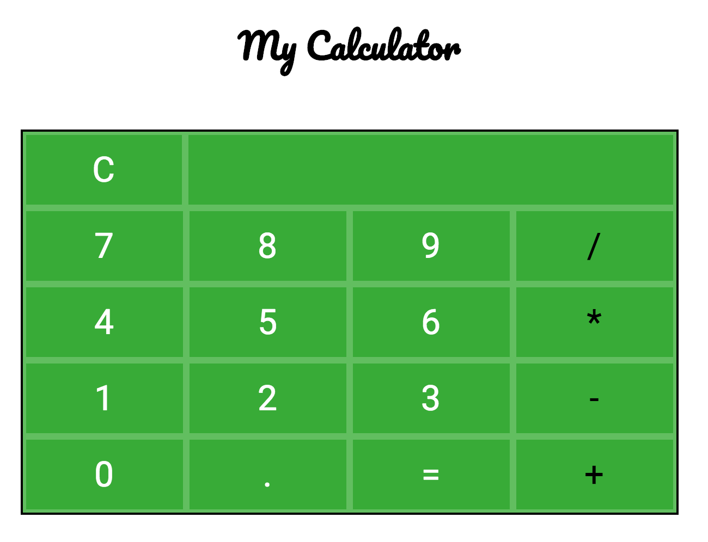

# Web Calculator

A simple calculator for the web. Supports
basic entry and four operations including
addition, subtraction, multiplication, and
division.

Design requirements:
- Display should truncate after 12 digits.
- Calculations are performed using math.js
- Vue.js is used for binding the display
